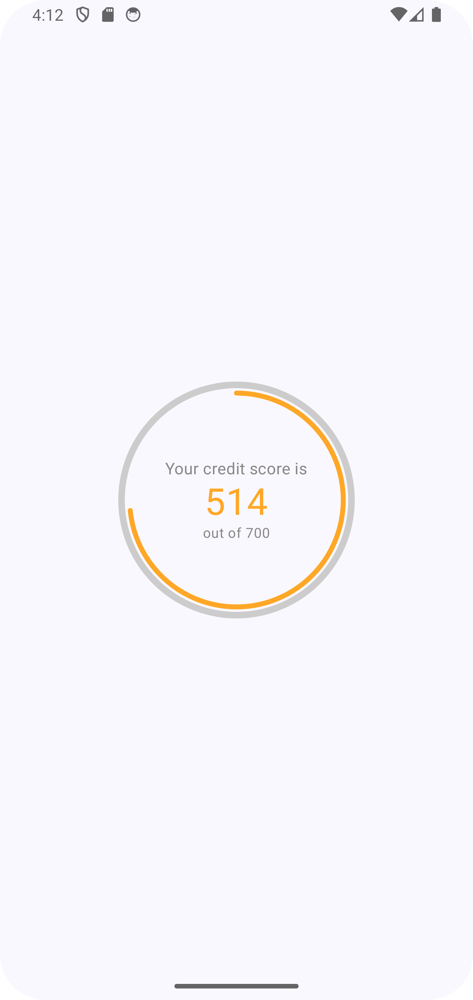

# **ClearScore Credit Score App**

## **Overview**
ClearScore Credit Score App is an Android application built using **Jetpack Compose** that fetches and displays a user's credit score in a **donut chart visualization**. The app is designed to be **scalable, testable, and production-grade**, following **SOLID** principles and modern Android development best practices.

This project serves as a technical submission for the **ClearScore Mobile Tech Task**, demonstrating my ability to work with **REST APIs, Jetpack Compose, MVVM architecture, dependency injection, and unit testing**.

---

## **Features**
 - Fetches real-time **credit score** data from a given API endpoint  
- Displays the credit score using a **donut chart** visualization  
- Implements **error handling** for API failures and network issues  
- Provides a **responsive UI** that adapts to different screen sizes  
- **Unit-tested ViewModel** to ensure reliability  
- **Follows MVVM Architecture** for maintainability and scalability  
- **Uses Hilt for Dependency Injection** for modular and testable code  
- **Follows Clean Architecture** with clear separation of concerns

---

## **Tech Stack & Tools**
| **Category**         | **Technology Used** |
|----------------------|--------------------|
| **Language**        | Kotlin |
| **UI Framework**    | Jetpack Compose |
| **Architecture**    | MVVM (Model-View-ViewModel) |
| **Networking**      | Retrofit |
| **Dependency Injection** | Hilt |
| **State Management** | Kotlin Flow |
| **Serialization**   | Kotlinx Serialization |
| **Testing**         | JUnit, MockK |

---

## **Project Structure**
The project follows a **clean architecture** approach to ensure scalability and maintainability.

```
📂 ClearScoreApp
 ├── 📂 app
 │   ├── 📄 ClearScoreApplication.kt  # Hilt setup for DI
 │   ├── 📄 MainActivity.kt            # Entry point of the app
 ├── 📂 core
 │   ├── 📂 data
 │   │   ├── 📄 ErrorMessages.kt       # Centralized error messages
 │   │   ├── 📂 network
 │   │       ├── 📄 NetworkConstants.kt  # API base URLs
 │   │       ├── 📄 NetworkUtils.kt      # API error handling
 │   ├── 📂 domain
 │   │   ├── 📄 ApiResponse.kt         # Sealed class for handling API responses
 │   ├── 📂 presentation
 │   │   ├── 📂 extensions
 │   │       ├── 📄 showToast.kt       # Helper for UI notifications
 ├── 📂 di
 │   ├── 📄 Modules.kt                 # Hilt DI modules
 ├── 📂 donut
 │   ├── 📂 data
 │   │   ├── 📂 dto
 │   │       ├── 📄 DonutResponseDto.kt  # Data model for API response
 │   │   ├── 📂 mappers
 │   │       ├── 📄 DonutMappers.kt      # Mapping API response to domain model
 │   │   ├── 📂 network
 │   │       ├── 📄 DonutApiService.kt   # Retrofit API interface
 │   │       ├── 📄 RemoteDataSource.kt  # Remote data fetcher
 │   │       ├── 📄 RetrofitRemoteDataSource.kt  # Retrofit implementation
 │   │   ├── 📂 repository
 │   │       ├── 📄 DefaultDonutRepository.kt  # Repository implementation
 │   ├── 📂 domain
 │   │   ├── 📄 Donut.kt                 # Domain model
 │   │   ├── 📄 DonutRepository.kt       # Repository interface
 │   ├── 📂 presentation
 │   │   ├── 📄 DonutScreen.kt           # UI screen for credit score
 │   │   ├── 📄 DonutScreenUiState.kt    # UI state management
 │   │   ├── 📄 DonutViewModel.kt        # ViewModel for handling logic
 ├── 📂 ui
 │   ├── 📂 theme
 │   │   ├── 📄 Color.kt                 # Theme colors
 │   │   ├── 📄 Theme.kt                 # Compose Material Theme setup
 │   │   ├── 📄 Type.kt                  # Typography settings
 ├── 📂 screenshots
 ├── 📄 build.gradle                      # Project dependencies
 ├── 📄 README.md                         # Project documentation
```

---

## **API Integration**
The app fetches the credit score from the provided **REST API** endpoint:

```
https://android-interview.s3.eu-west-2.amazonaws.com/endpoint.json
```

**Retrofit** is used to handle network requests efficiently.  
**Coroutines & Flow** ensure smooth asynchronous data fetching.  
**Error Handling** manages failures gracefully (e.g., network errors, empty data).  
**Serialization** is handled using **Kotlinx Serialization**.

---

## **How to Run the Project**
1. **Clone the repository**
   ```sh
   git clone https://github.com/Zinan10/ClearScore.git
   cd ClearScore
   ```
2. **Open the project in Android Studio** (latest version)
3. **Build & Run the app** on an emulator or physical device
4. Ensure you have a **stable internet connection** to fetch the credit score data

---

## **Future Enhancements**
**Caching & Offline Support** – Store credit scores for offline viewing  
**Custom Themes & UI Enhancements** – Improve animations and UI polish  
**Localization Support** – Add support for multiple languages  
**Historical Score Tracking** – Allow users to track score changes over time  
**Improve Test Coverage** – Expand UI tests with Compose Test Rule

---
## **App screenshot**




## **Final Thoughts**
This project demonstrates my ability to develop **scalable, testable, and maintainable** Android applications using **Jetpack Compose, MVVM, and Kotlin Coroutines**. I focused on **clean code practices, error handling, and testing** to ensure a high-quality submission.
